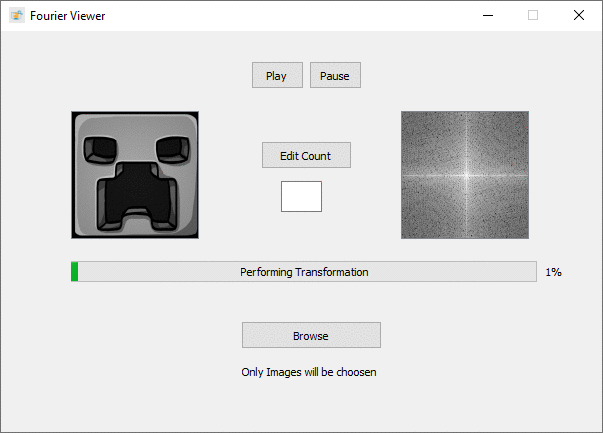
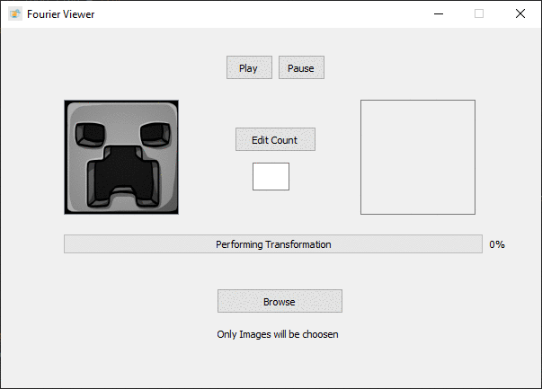

# Projects
## Basic Image processing Project with GUI
### In This Project 
1. A 128 * 128 image is received in grey scale
2. 2D discrete Fourier transform is applied on the image
   * Using ```numpy.fft.fft2() ```
   * Then Low Frequency values are shifted towards the center 
   * Using ``` np.fft.fftshift()```
   * Then The magnitude spectrum of the image is drawn
3. One of the 2D filters are applied on it image ( High Pass Filter or Low Pass Filter )
4. 2D Discrete Inverse Fourier Transform is applied and the image is transformed back with the effect of the filter 
   * Using ``` numpy.fft.ifftshift() ``` 
5. The effect on the image is as follows 

  |Filter|Observed Effect on Image|
  |-----------------|-----------------|
  |High Pass Filter |Edge Detection|
  |Low Pass Filter |Blurring|
 
### Explanation

#####  High Pass Filter
* It removes low frequencies and allows only high frequencies
* Edges in Images are characterised by high frequency Values
* Low frequency components of the image is shifted towards the center  
* Then removing pixel values in the center by replacing it with zeros will eliminate low frequencies
leaving only high frequency components
* Then replacing the values by zeros starting from the center outwards can be done
by slicing the array that holds the values resulting in the appearance of black rectangle of variable width in the center
```python
fshift[centerrowposition - width:centerrowposition + width, centercolposition - width:centerrowposition + width] = 0
```
* In a 128 * 128 image the center row and center column positions are 64 , width can be any number from 1 to 64
* As the width of the rectangle increases more low frequency components are removed leaving only high frequency components 
leading to the detection of edges in the image as shown :
   
     

##### Low Pass Filter

* It removes High frequency components and allows only Low frequency components of the image
* Edges in Images are characterised by high frequency Values
* Low frequency components of the image is shifted towards the center  
* Then replacing the pixel values by zeros starting from the Borders inwards towards the center will remove high frequency
components leaving low frequency components that is shifted towards the center
* by using the following functiion  
```python

def box(clwidth, rowwidth, img, imgwidth, imgheight):
    img[0:rowwidth, 0:] = 0                                     # row1 top side of the square
    img[imgheight - rowwidth:imgheight, 0:] = 0                 # row2 bottom side of the square
    img[0:, 0:clwidth] = 0                                      # col1 right side of the square
    img[0:, imgwidth - clwidth:imgwidth] = 0                    # left side of the square
    return img
    
```
* Resulting in the appearance of 4 black rectangles of variable width on the Borders of the image
* Column and row width can be any number from 1 to 64
* As the width of the box increases more high frequency components are removed leaving only low frequency components 
leading to blurring of the image as shown :

    
    
##### GUI Features
  |Object|Function|
  |-----------------|-----------------|
  |Browse Button|Browse an image and open it in grey scale|
  |Play Button|Start/Continue Transformation|
  |Pause Button|Pause Transformation|
  |Left Label|View Image|
  |Right Label|View Magnitude Spectrum of Image|
  |Edit Count Button and Line Edit|Increment / Decrement Speed of Transformation|
  
    
### Useful Links
 * *[2D Fourier Transform](http://eeweb.poly.edu/~yao/EL5123/lecture4_2DFT.pdf)*
 * *[Open CV](https://docs.opencv.org/3.0-beta/doc/py_tutorials/py_imgproc/py_transforms/py_fourier_transform/py_fourier_transform.html)*
 * *[GUI using PyQt5](https://www.youtube.com/watch?v=ksW59gYEl6Q)*
 
